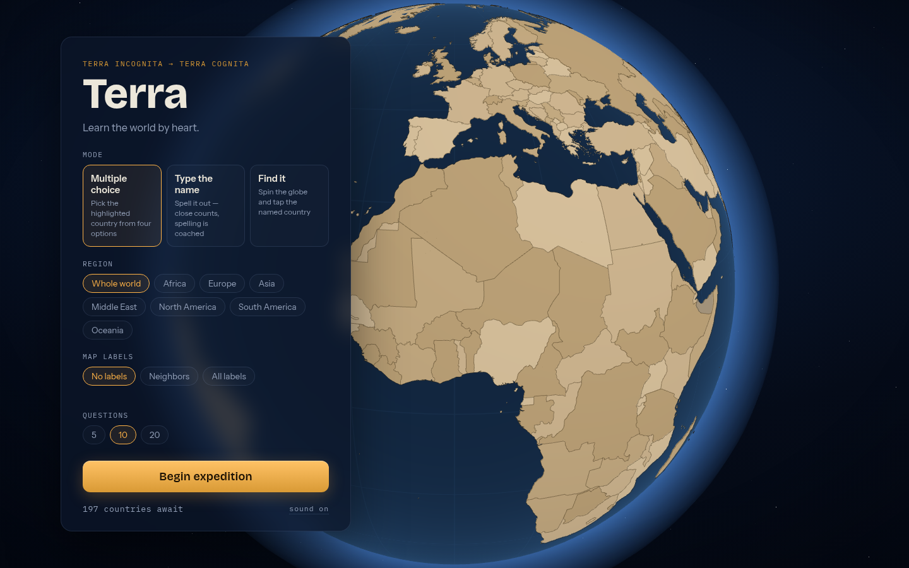

# Terra — learn the world by heart

A geography learning game on an interactive 3D globe. A country lights up; you name it.



## Play modes

- **Multiple choice** — pick the highlighted country from four options (distractors come from the same region)
- **Type the name** — spelling is coached, not punished: aliases ("Ivory Coast" / "Côte d'Ivoire"), diacritics, and near-miss typos all count, but typing a *different* country's name never does
- **Find it** — the name is shown; spin the globe and tap the country. Miss, and the camera flies you to the right answer

Difficulty dial: show no labels, neighbor labels, or the full atlas. Filter by region, 5/10/20 questions.

**Smart review**: per-country progress (Leitner boxes in localStorage) weights questions toward what you miss, mixes in unseen countries, and resurfaces stale ones. Sessions end with a report and one-tap review of your misses.

## Stack

React 19 + TypeScript + Vite · three.js via @react-three/fiber · zustand · motion · vitest

The globe is a vector globe: all ~240 country polygons are tessellated onto the sphere ([three-conic-polygon-geometry](https://github.com/vasturiano/three-conic-polygon-geometry)) and merged into a single draw call; per-country color lives in a 256×1 palette texture, so hover/highlight/answer-flash cost a 4-byte write. Borders are great-circle-resampled polylines; labels are SDF text with horizon fade and screen-space declutter. Geodata is Natural Earth 50m via [world-atlas](https://github.com/topojson/world-atlas), joined to [world-countries](https://github.com/mledoze/countries) for names, aliases, and regions.

The game layer never touches three.js — it speaks to the globe through one typed props contract (`src/globe/GlobeProps.ts`). Content access and progress persistence sit behind async interfaces (`src/services.ts`), so a backend can slot in without touching callers.

## Develop

```bash
npm install
npm run dev        # http://localhost:5173
npm test           # unit tests (answer matching, selection weighting, progress)
npm run build      # typecheck + production build
npm run generate-data  # regenerate countries.json + countryMeta.json
```

## Roadmap

Capitals, rivers, mountain ranges, and bays are data additions, not rewrites — the `Feature` model and globe layers are kind-generic. A sync backend can replace the localStorage progress store behind its existing interface.
